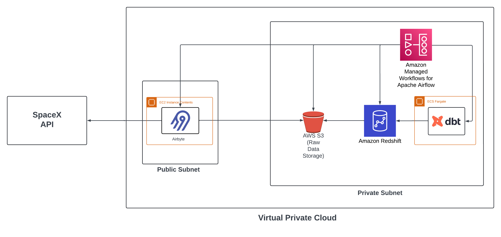

# Part 1: Data Architecture

## Overview

This section presents the data architecture for an end-to-end ETL pipeline designed to extract, load, and transform SpaceX launch data using modern AWS-based tooling. The pipeline uses Airbyte, AWS S3, Amazon Redshift, Managed Workflows for Apache Airflow (MWAA), and dbt to deliver a modular, scalable, and observable data platform.

## Architecture Diagram

## Components and Flow

The pipeline architecture is split between a **public subnet** for external-facing services and a **private subnet** for internal processing and storage:

### Public Subnet
- **Airbyte (EC2)**: Responsible for extracting data from the SpaceX API. Hosted in the public subnet to allow secure outbound internet access. Outputs raw data to S3 in JSON format.

### Private Subnet
- **Amazon S3**: Serves as a landing zone (raw layer) for extracted data. Decouples ingestion from transformation and acts as backup.
- **Amazon Redshift**: Used as the analytical data warehouse. Loads data from S3 using a Python script triggered via Airflow.
- **Amazon MWAA (Managed Airflow)**: Orchestrates the pipeline. Manages task dependencies, retries, and scheduling of the extraction, loading, and transformation steps.
- **dbt (hosted on ECS Fargate)**: Executes SQL-based data transformations inside Redshift, including testing and documentation. Triggered by Airflow as part of the pipeline.

---

## Why These Decisions?

### Airbyte
- **Rationale**: Chosen for its fast setup and native SpaceX connector. Running it on EC2 in the public subnet is the simplest way to enable internet access without exposing private resources.

### S3 as Staging Layer
- **Rationale**: Acts as a durable buffer between ingestion and loading. Supports decoupling, fault tolerance, and reprocessing if needed. It also simplifies debugging and auditing.

### Redshift
- **Rationale**: Required by the challenge. Redshift fits well as a performant MPP warehouse for structured analytical queries. Integration with S3 via the `COPY` command is straightforward and efficient.

### MWAA
- **Rationale**: Using a managed version of Airflow reduces operational burden and aligns with AWS-native infrastructure. It ensures scheduling, monitoring, and failure recovery of all pipeline steps.

### dbt
- **Rationale**: Enables modular, testable, and version-controlled transformations. Using dbt within Redshift ensures transformations are scalable and easy to maintain.

---

## Flow Summary

1. **Airbyte** extracts data from SpaceX API → stores raw JSON in **S3**.
2. **Airflow** triggers a Python script to **load data from S3 into Redshift** using the `COPY` command.
3. **dbt** is orchestrated by Airflow to run in-warehouse transformations inside **Redshift**.

---

## Security and Access Control

- Airbyte runs in a public subnet with strict outbound-only access.
- Redshift, S3, and dbt reside in a private subnet, unreachable from the internet.
- Access between services is managed via IAM roles with least-privilege policies.
- Secrets (e.g., Redshift credentials) are stored securely via AWS Secrets Manager or SSM Parameter Store.

---

## Next Steps

See `terraform/` for the infrastructure-as-code definition to deploy the Redshift cluster and other resources.
